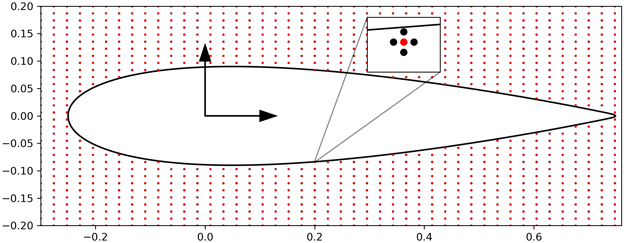
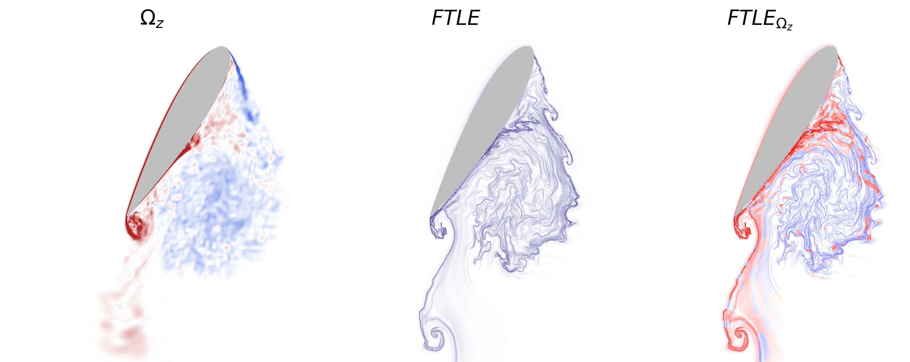

# Summary

The Finite-Time Lyapunov Exponent (FTLE) field is a fundamental quantity for analysis of dynamical systems, with particular applications in fluid mechanics and transport phenomena. It enables the identification of
Lagrangian Coherent Structures (LCSs) [@Haller_annual_review] by characterizing the trajectories of attracting, repelling and shearing material surfaces in manifolds. Hence, the FTLE plays a crucial role in elucidating
transport mechanisms and identifying separatrices in fluid flows [@Brunton_LCS]. This work presents a Python-based solver for computing FTLE fields from velocity data, featuring optimized integration techniques and parallel computations.

The proposed implementation is designed for high performance using Numba, allowing for fast Lagrangian particle advection and efficient gradient estimation. The solver is flexible and modular, supporting structured grids and arbitrary velocity fields while maintaining a well-documented and user-friendly interface.

# Statement of Need

Understanding transport barriers and coherent structures in unsteady flows is crucial in various scientific and engineering applications such as oceanography, meteorology, and aerodynamics. Despite the importance of FTLE computations, existing implementations are often specialized, computationally expensive, or lack extensibility.

This Python solver addresses these limitations by:
- Providing an efficient and flexible implementation for computing FTLE fields;
- Offering modularity for easy adaptation to different problems and datasets;
- Allowing for an easy extension of different types of file formats to read velocity fields and grid data;
- Leveraging Numba for computational efficiency in particle advection;
- Enabling parallelized FTLE computations for improved performance.


# Implementation

Initially, a grid of particles $X_{0} \subset \mathbb{R}^{2}$ is established across the domain of interest. These particles are integrated in the velocity field from the initial time $0$ to the final time $T$, yielding a time-T particle flow map denoted as $\Phi_{0}^{T}$ defined as follows:

$$
\Phi_{0}^{T}: \mathbb{R}^{2} \to \mathbb{R}^{2}; \mathbf{x}(0) \mapsto \mathbf{x}(0) + \int_{o}^{T} \mathbf{u}(\mathbf{x}(\tau), \tau)  d\tau \mbox{ .}
$$

Here, $\mathbf{u}(\mathbf{x}(\tau), \tau)$ denotes the time-dependent velocity field over the particle trajectory $\mathbf{x}(\tau)$ at a time $\tau$. The flow map Jacobian $\mathbf{D} \Phi_{0}^{T}$ is then computed by a central finite difference scheme using the neighbouring particles in a Cartesian mesh such as:

$$
\mathbf{D} \Phi_{0}^{T} = \left[
\begin{array}{cc}
\frac{\Delta x(T)}{ \Delta x (0)} & \frac{\Delta x(T)}{ \Delta y (0)} \\
\frac{\Delta y(T)}{ \Delta x (0)} & \frac{\Delta y(T)}{ \Delta y (0)}
\end{array}
\right] = \left[
\begin{array}{cc}
\frac{x_{i+1,j}(T)- x_{i-1,j} (T) }{ x_{i+1,j}(0)- x_{i-1,j}(0) } &  \frac{x_{i,j+1}(T)- x_{i,j-1} (T) }{ y_{i,j+1}(0)- y_{i,j-1}(0)}\\
\frac{y_{i+1,j}(T)- y_{i-1,j} (T) }{ x_{i+1,j}(0)- x_{i-1,j}(0) } &  \frac{y_{i,j+1}(T)- y_{i,j-1} (T) }{ y_{i,j+1}(0)- y_{i,j-1}(0) }
\end{array}
\right] \mbox{ ,}
$$

where $x$ and $y$ denote the particle coordinates and subscripts $i$ and $j$ denote their indices in the computational domain. Finally, the Cauchy-Green deformation tensor is computed as:

$$
\boldsymbol{\Delta} = (\mathbf{D} \Phi_{0}^{T})^{\ast} \mathbf{D} \Phi_{0}^{T} \mbox{ .}
$$

Here, $\ast$ denotes the transpose and the largest eigenvalue $(\lambda_{max})$ from this tensor is computed to form the FTLE field,

$$
\sigma (\mathbf{D} \Phi_{0}^{T} ; \mathbf{x_{0}}) = \frac{1}{\lvert T \rvert} \log{ \sqrt{\lambda_{max}(\boldsymbol{\Delta} (\mathbf{x_{0}}))}} \mbox{ .}
$$

The FTLEs are computed using an auxiliary grid in which the flow properties are interpolated on. \autoref{fig:numerical_method} presents an example of the spatial discretization approach used in the present study. A reference mesh (indicated by the red dots in \autoref{fig:numerical_method}) is first placed on top of the flow grid and the overlapping points on the airfoil solid surface are removed. The auxiliary grid (represented by the black dots) is then constructed with the maximum distance allowed from the reference points to the airfoil surface ensuring that all points remain outside the solid body, as shown in the inset plot. For each different initial condition this process is repeated with the reference mesh created yielding a square field of view of $\pm 1.5 C$ centered on the airfoil quarter-chord frame of reference, indicated by the black arrows. The auxiliary points are then integrated along the flow using a second-order Adams-Bashforth/fourth order Runge-Kutta/Euler method. At each integration step, the velocity field at each individual particle position is determined by interpolation of the original flow data. Different interpolation schemes are implemented and the code is structured for easy implementation of additional schemes.

{ width=70% }

The FTLE fields can be computed by integrating the particles in forward or backward time. This choice yields different interpretations of the LCSs providing analogs for stable (forward time integration) and unstable manifolds (backward time integration) from dynamical systems [@Brunton_LCS; @Haller_annual_review]. In the present work we employ the backward time integration of the particles as it enables a direct measure of material transport in forward time, mimicking experimental flow visualization by tracers. This choice is justified since we are most interested in visualizing the different interactions among vortices, shear layers and wake patterns associated with particular flow configurations. These patterns are characterized by the ridges of the backward time FTLE field. An example of the backward-time FTLE field is provided in \autoref{fig:example}. While backward-time FTLE fields provide attraction regions in forward time, forward-time FTLE fields provide repelling regions. Hence, flow control strategies can be sought through visualization of FTLE fields as shown in @Lucas_toappear. The overlapping between backward and forward-time FTLE fields characterize saddle points in the flowfield that would be ideal for actuation placement.



# Example Usage

The solver requires several parameters, which can be passed through the command line or a configuration file.

Run the script with the required parameters:

```bash
python main.py --experiment_name "my_experiment" \
               --list_velocity_files "velocity_files.txt" \
               --list_grid_files "grid_files.txt" \
               --list_particle_files "particle_files.txt" \
               --snapshot_timestep 0.1 \
               --flow_map_period 5.0 \
               --integrator "rk4" \
               --interpolator "cubic" \
               --num_processes 4
```

Alternatively, use a configuration file:

```bash
python main.py -c config.yaml
```

### **Required Parameters**

+----------------------+---------+-----------------------------------------------------------+
| Parameter            | Type    | Description
+======================+=========+===========================================================+
| `experiment_name`    | `str`   | Name of the subdirectory where the FTLE fields will be
|                      |         | saved.
+----------------------+---------+-----------------------------------------------------------+
| `list_velocity_files`| `str`   | Path to a text file listing velocity data files.
+----------------------+---------+-----------------------------------------------------------+
| `list_grid_files`    | `str`   | Path to a text file listing grid files.
+----------------------+---------+-----------------------------------------------------------+
| `list_particle_files`| `str`   | Path to a text file listing particle data files.
+----------------------+---------+-----------------------------------------------------------+
| `snapshot_timestep`  | `float` | Timestep between snapshots (positive for forward-time
|                      |         | FTLE, negative for backward-time FTLE).
+----------------------+---------+-----------------------------------------------------------+
| `flow_map_period`    | `float` | Integration period for computing the flow map.
+----------------------+---------+-----------------------------------------------------------+
| `integrator`         | `str`   | Time-stepping method (`rk4`, `euler`, `ab2`).
+----------------------+---------+-----------------------------------------------------------+
| `interpolator`       | `str`   | Interpolation method (`cubic`, `linear`, `nearest`,
|                      |         | `grid`).
+----------------------+---------+-----------------------------------------------------------+
| `num_processes`      | `int`   | Number of workers in the multiprocessing pool. Each
|                      |         | worker computes the FTLE of a snapshot.
+----------------------+---------+-----------------------------------------------------------+


### **File Requirements**

- The `list_velocity_files` must be a `.txt` file with the path to the velocity files. Make sure the listed files are ordered according to their simulation time (ascending order).

- The `list_grid_files` and `list_particle_files` must also be `.txt` files. For moving bodies, you can have multiple files (same number as the number of velocity files), but if the mesh grid is fixed, then you can have a single item in both `list_grid_files` and `list_particle_files` lists.

- The current implementation supports MATLAB file formats. The MATLAB velocity file should contain columns labeled `velocity_x` and `velocity_y`. The grid file should include `coordinate_x` and `coordinate_y` headers.

- The particle files must include the headers: `left`, `right`, `top`, and `bottom`, as illustrated in the accompanying figure. These headers define the positions of four neighboring particles surrounding a central location, where the FTLE is computed.


# Recent works using pyFTLE

To date, the works that used pyFTLE include: @Lucas_toappear, @SLui_2024, and @Lucas_2024


# Acknowledgements

We acknowledge Fundação de Amparo à Pesquisa do Estado de São Paulo (FAPESP) for supporting this work under Grants No. 2013/08293-7, 2013/07375-0, 2021/06448-0, 2022/08567-9 and 2022/09196-4.

# References
